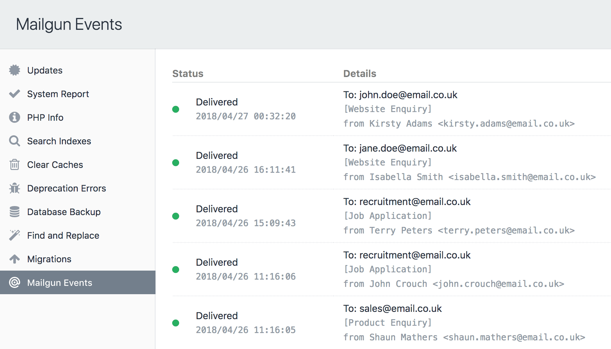

# Mailgun Events plugin for Craft CMS 3

Track Mailgun events from the utilities section



## Requirements

This plugin requires Craft CMS 3.0.0 or later and [Mailgun 1.2.0](https://github.com/craftcms/mailgun) or later.

## Installation

To install the plugin, either install via the plugin store or follow these instructions.

1. Open your terminal and go to your Craft project:

        cd /path/to/project

2. Then tell Composer to load the plugin:

        composer require lukeyouell/craft-mailgunevents

3. In the Control Panel, go to Settings → Plugins and click the “Install” button for Mailgun Events.

## Configuring Mailgun Events

As the plugin uses your Mailgun settings as defined in the email settings section, there's no need to provide your API credentials again.

Upon successful installation you will be able to choose which events to track and how many results you would like to request from Mailgun.

### Event Type Options

| Event Type | Description |
| ---------- | ----------- |
| `accepted` | Mailgun accepted the request to send/forward the email and the message has been placed in queue. |
| `clicked` | The email recipient clicked on a link in the email. Click tracking must be enabled in the Mailgun control panel, and the CNAME record must be pointing to mailgun.org. |
| `complained` | The email recipient clicked on the spam complaint button within their email client. Feedback loops enable the notification to be received by Mailgun. |
| `delivered` | Mailgun sent the email and it was accepted by the recipient email server. |
| `failed` | Mailgun could not deliver the email to the recipient email server. |
| `opened` | The email recipient opened the email and enabled image viewing. Open tracking must be enabled in the Mailgun control panel, and the CNAME record must be pointing to mailgun.org. |
| `rejected` | Mailgun rejected the request to send/forward the email. |
| `stored` | Mailgun has stored an incoming message. |
| `unsubscribed` | The email recipient clicked on the unsubscribe link. Unsubscribe tracking must be enabled in the Mailgun control panel. |

### Limit Options

From the plugin settings page you are able to choose from a list of predefined values, but you can set your own value by overriding the plugin settings.

## Overriding Plugin Settings

If you create a [config file](https://docs.craftcms.com/v3/configuration.html) in your `config` folder called `mailgun-events.php`, you can override the plugin’s settings in the Control Panel. Since that config file is fully [multi-environment](https://docs.craftcms.com/v3/configuration.html) aware, this is a handy way to have different settings across multiple environments.

Here’s what that config file might look like along with a list of all of the possible values you can override.

```php
<?php

return [
    'eventTypes' => ['delivered', 'failed'],
    'limit'      => 50,
];
```

## Mailgun Events Roadmap

Some things to do, and ideas for potential features:

Brought to you by [Luke Youell](https://github.com/lukeyouell)
